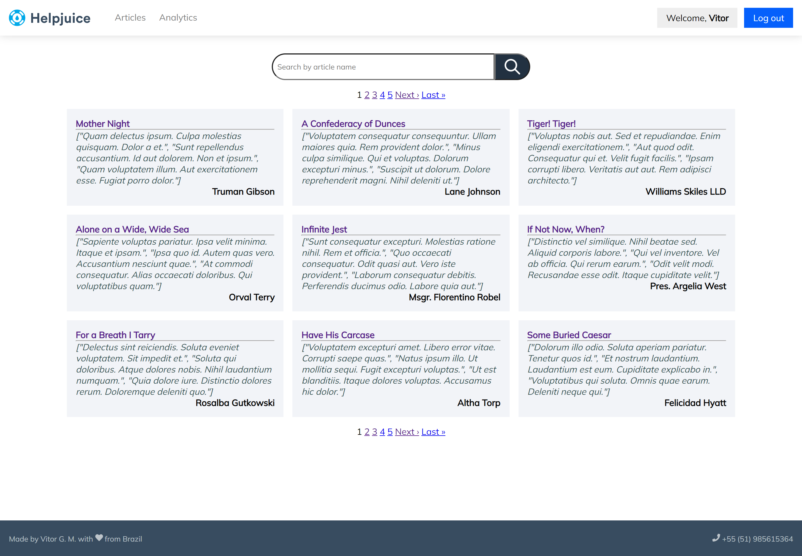

 
# Real-Time-Search Engine

The purpose of this project is to record different user's inputs in realtime and ultimately display analytics & trends on what people are searching for the most. It is built mainly with Ruby on Rails.

# Quick view

# Live Demo Version

[live version](https://helpjuice-vitorguedes.herokuapp.com/)

## Getting Started

- Check the node version or if you have one at all by running `node -v ` if you get something like this `v14.17.6` you have Ruby installed.
- Clone the repository by running `git clone https://github.com/VitorGuedesMadeira/Real-Time-Search-Engine.git` in your CLI.
- Type `cd Real-Time-Search-Engine`
- Type `code .`
- Run `bundle install` to install all dependencies
- Run `rails db:create db:migrate db:seed` to create and populate the DataBase
- Run `rails server`
- Open Browser `http://localhost:3000/`

## Testings

- Run `rspec spec/` to run all the tests

## Author

👤 **Vitor Guedes Madeira** 🧑🏻‍💻
- GitHub: [@vitorguedesmadeira](https://github.com/VitorGuedesMadeira)
- Twitter: [@CDahguedes](https://twitter.com/CDahguedes)
- LinkedIn: [Vitor Guedes](https://www.linkedin.com/in/vitor-guedes-madeira/)

## 🤝 Contributing

Contributions, issues, and feature requests are welcome!
Feel free to check the [issues page](https://github.com/VitorGuedesMadeira/Real-Time-Search-Engine/issues).

## Show your support

Give a ⭐️ if you like this project!

## Design Template

- We give credit to [HelpJuice](https://helpjuice.com/) the author of this project's idea.

## 📝 License

This project is [MIT](./MIT.md) licensed.
